# Delivery Module

The mail path. Everything between "a tenant's mail server hands us a message" and "the recipient's MX has it, and we have written down what happened."

> **Note:** mail no longer flows straight from the SMTP session into processing. The
> receiver publishes to a Redis Stream and returns; a worker pool consumes it. Sections
> covering the pipeline, admission control, concurrency and shutdown below have been
> updated for that; the policy, matching, restriction, relay and audit sections are
> unchanged and remain accurate.

This is the only module in the backend with **no HTTP surface**. It registers no routes and no handlers. It is driven entirely by an SMTP listener started in [`cmd/api/main.go`](../../cmd/api/main.go), does its work on detached goroutines, and reports outcomes through two injected recorder interfaces that write to MongoDB. The dashboard reads those records back through `internal/audit`, which this module never imports.

| Sub-package | Files | LOC | Responsibility |
|---|---:|---:|---|
| *(root)* | 3 | 385 | Shared vocabulary, goroutine dispatch, adapters onto `admin` storage |
| [`receiver/`](receiver/) | 3 | 361 | SMTP ingress, sender authorization, admission control |
| [`engine/`](engine/) | 25 | 2,319 | Policy resolution, restriction and content evaluation, actions, incidents |
| [`relay/`](relay/) | 3 | 661 | DKIM signing, MX resolution, STARTTLS delivery with retry |
| [`utils/`](utils/) | 2 | 174 | Every constant and sentinel error in the module |

The runtime path, end to end:

```
session.Data → Dispatcher.Dispatch → Engine.Process → EvaluationService.Enforce → Relay.Deliver → Recorder.Complete
```

## Contents

1. [Runtime workflow](#1-runtime-workflow)
2. [Package dependency graph](#2-package-dependency-graph)
3. [Class diagrams](#3-class-diagrams)
4. [Package structure](#4-package-structure)
5. [Component reference](#5-component-reference)
6. [Low-level implementation notes](#6-low-level-implementation-notes)
7. [Data and configuration reference](#7-data-and-configuration-reference)
8. [Concurrency, failure and lifecycle](#8-concurrency-failure-and-lifecycle)
9. [Design discussion](#9-design-discussion)
10. [Extension points](#10-extension-points)

---

## 1. Runtime workflow

### 1.1 Pipeline

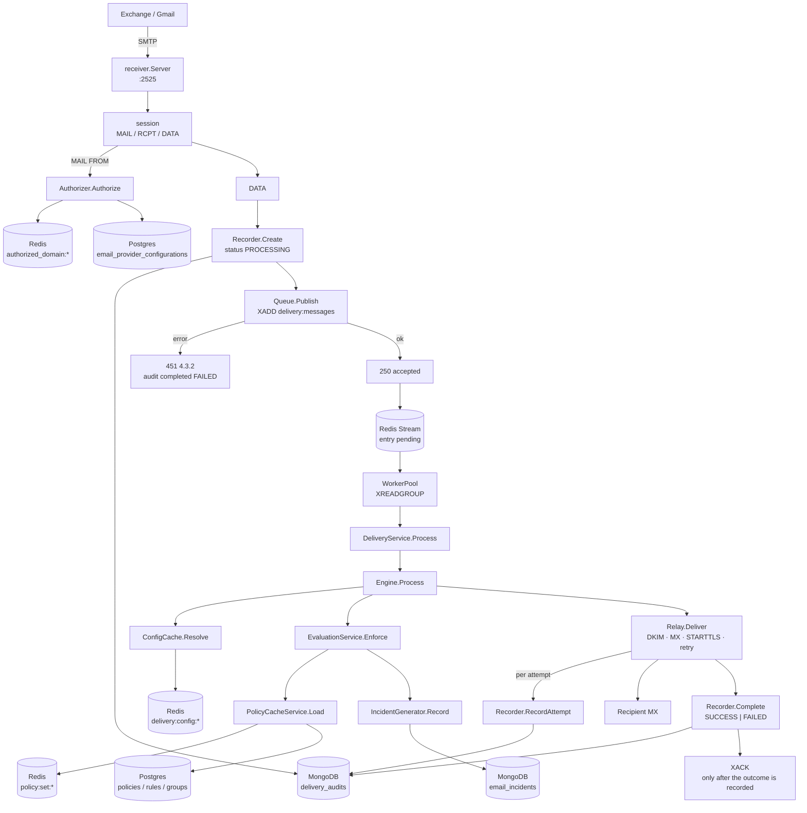

`250` is returned only once Redis has accepted the entry — that is the whole contract of the handoff. If the publish fails the receiver completes the audit record as `FAILED` and answers `451`, so the sending MTA retries. Everything below the stream runs in the worker pool, which a crash cannot lose: an entry stays pending until `XACK`, and `XAUTOCLAIM` hands it to another worker after `DELIVERY_CLAIM_IDLE`.

### 1.2 Accepted and delivered

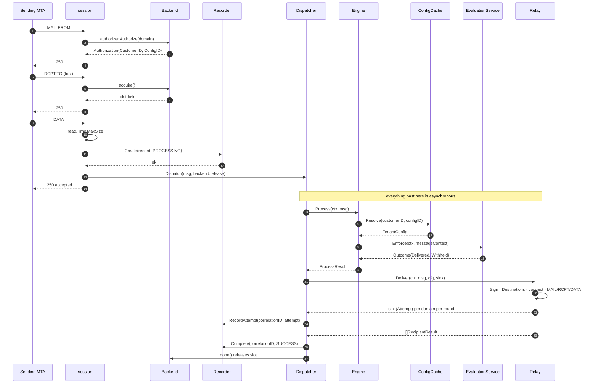

### 1.3 Flagged by policy

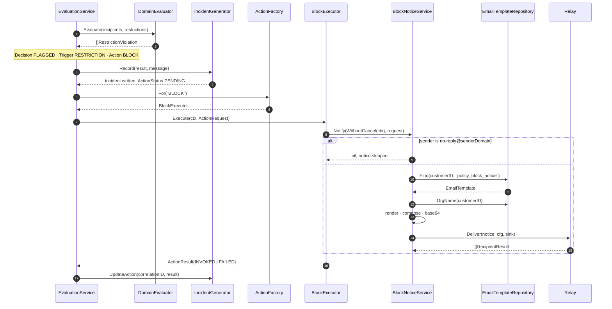

The block notice is the only way a sender learns their mail was withheld — by the time the policy runs, the gateway has already returned `250`.

### 1.4 Enforcement decision flow

Mirrors [`evaluation_service.go:33-111`](engine/evaluation/evaluation_service.go#L33-L111).

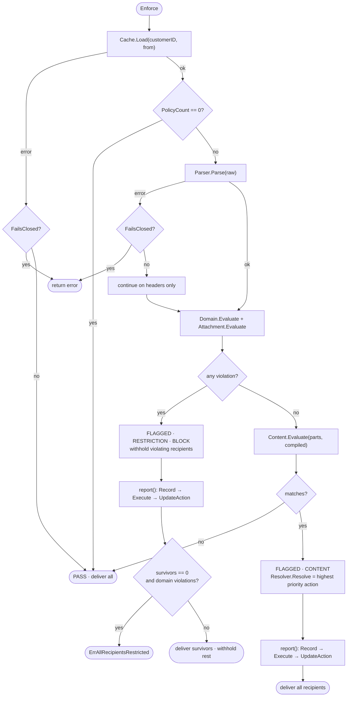

Note the asymmetry: a **restriction** violation always forces `BLOCK` and withholds recipients. A **content** match resolves to whichever action the matched policies carry, and — regardless of whether that action is `BLOCK` — the message is still handed to the relay with all recipients intact. Only restrictions remove recipients.

### 1.5 Recipient state

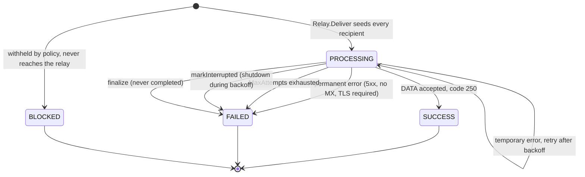

`pendingRecipients` drives the retry set: a recipient leaves it when `Status == SUCCESS` or `Permanent == true`. `BLOCKED` recipients are produced by `evaluation.Withhold` and appended to the relay's results afterwards — they are never sent.

---

## 2. Package dependency graph

Twenty packages. The edges below are what the compiler reports, not a hand drawing:

```
go list -deps=false -f '{{.ImportPath}}{{range .Imports}}{{if eq (printf "%.13s" .) "dpdp-backend/"}}
   -> {{.}}{{end}}{{end}}' ./internal/delivery/...
```

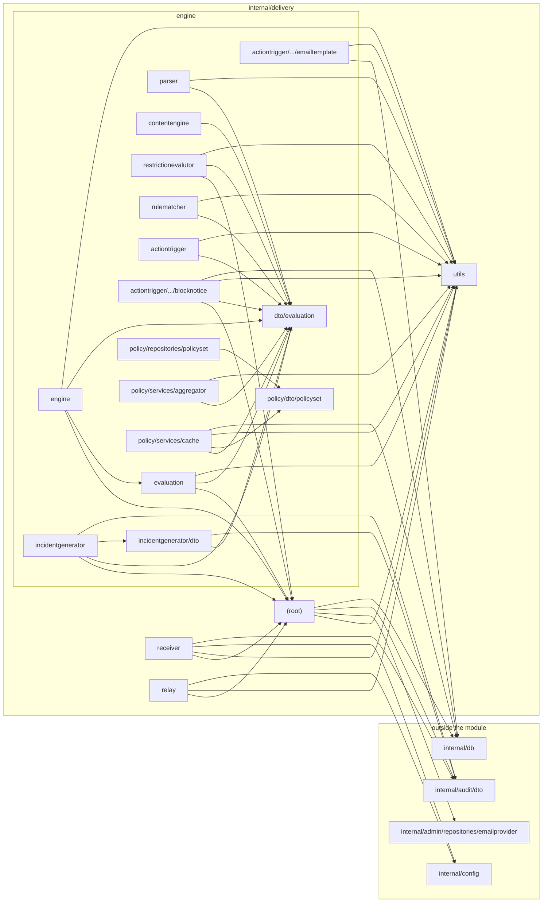

What the graph says:

- **`engine/dto/evaluation` and `engine/policy/dto/policyset` are leaves** — zero internal imports. Every engine component depends inward on them and they depend on nothing. They are the module's stability anchor.
- **`utils` is the second hub**, imported by 13 of the other 19 packages.
- **The root `delivery` package holds the shared vocabulary** — imported by `receiver`, `relay`, `engine`, `evaluation`, `restrictionevalutor`, `incidentgenerator` and `blocknotice`.
- **The graph is acyclic**, including the one place you would expect a cycle. `blocknotice` sends the notice through the relay, but it does **not** import `relay`. It declares its own `Sender` and `ConfigLoader` interfaces over `delivery` types, and [`main.go:140-143`](../../cmd/api/main.go#L140-L143) passes the concrete `*relay.Relay` in. The dependency is inverted at the wiring seam.
- **Only four packages reach outside the module**: the root (`admin`, `audit/dto`, `db`), `receiver` and `relay` (`config`), `incidentgenerator` and its dto (`audit/dto/emailincident`), and `blocknotice`/`emailtemplate`/`policy cache` (`db`, for GORM models).

---

## 3. Class diagrams

### 3.0 Master diagram

Orientation map: the principal types of each package and how they connect. Members are omitted here and the value/DTO types are left to 3.2–3.4 — the module declares 104 types in total, and drawing all of them in one diagram makes none of them legible.

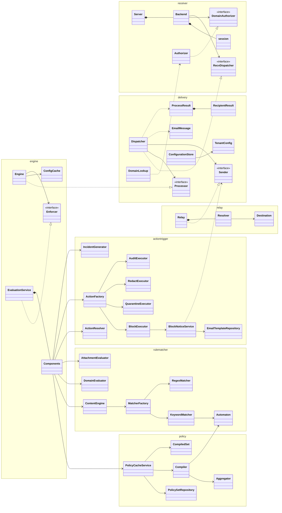

`RecvDispatcher` is `receiver.Dispatcher`, renamed here only to avoid a name clash with `delivery.Dispatcher` in one diagram.

### 3.1 Ingress and dispatch

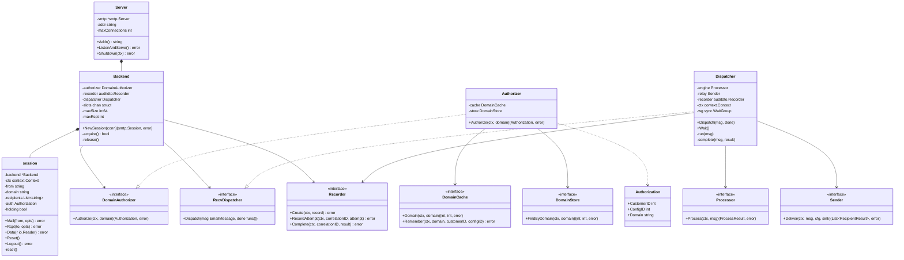

`Recorder` is `audit/dto/deliveryaudit.Recorder` — an external port. The module holds the interface, never the implementation.

### 3.2 Core value types and adapters

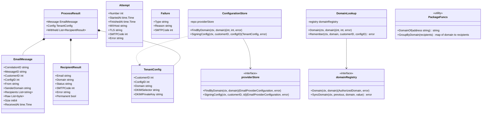

### 3.3 Engine contracts

All 16 interfaces live in [`engine/dto/evaluation/evaluation_dto.go`](engine/dto/evaluation/evaluation_dto.go).

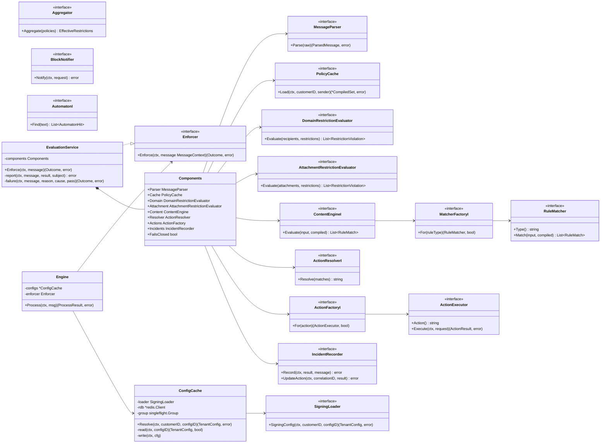

Interface names carrying an `I` suffix above (`ContentEngineI`, `ActionFactoryI`, `MatcherFactoryI`, `ActionResolverI`, `AutomatonI`) are named plainly in the source — the suffix only disambiguates them from the concrete types of the same name in diagram 3.5.

### 3.4 Policy resolution and compilation

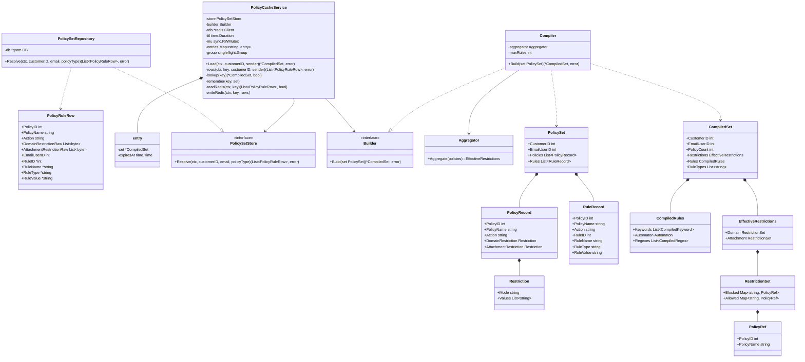

### 3.5 Matching, restrictions and actions

```mermaid
classDiagram
    direction TB

    class ContentEngine {
        -factory MatcherFactory
        +Evaluate(input, compiled) List~RuleMatch~
    }

    class MatcherFactory {
        -matchers Map~string, RuleMatcher~
        +For(ruleType) (RuleMatcher, bool)
    }

    class KeywordMatcher {
        +Type() string
        +Match(input, compiled) List~RuleMatch~
    }

    class RegexMatcher {
        -maxMatches int
        +Type() string
        +Match(input, compiled) List~RuleMatch~
        -count(expression, text) int
    }

    class Automaton {
        -nodes List~node~
        +Find(text) List~AutomatonHit~
        -link()
    }

    class node {
        -next Map~byte, int~
        -fail int
        -lengths List~int~
        -outputs List~int~
    }

    class DomainEvaluator {
        +Evaluate(recipients, restrictions) List~RestrictionViolation~
    }

    class AttachmentEvaluator {
        +Evaluate(attachments, restrictions) List~RestrictionViolation~
    }

    class MessageParser {
        +Parse(raw) (ParsedMessage, error)
        -degraded(raw) ParsedMessage
    }

    class ActionResolver {
        +Resolve(matches) string
    }

    class ActionFactory {
        -executors Map~string, ActionExecutor~
        +For(action) (ActionExecutor, bool)
    }

    class BlockExecutor {
        -notifier BlockNotifier
        +Action() string
        +Execute(ctx, request) (ActionResult, error)
    }
    class QuarantineExecutor {
        +Action() string
        +Execute(ctx, request) (ActionResult, error)
    }
    class RedactExecutor {
        +Action() string
        +Execute(ctx, request) (ActionResult, error)
    }
    class AuditExecutor {
        +Action() string
        +Execute(ctx, request) (ActionResult, error)
    }

    class BlockNoticeService {
        -templates TemplateStore
        -configs ConfigLoader
        -relay Sender
        +Notify(ctx, request) error
    }

    class TemplateStore {
        <<interface>>
        +Find(ctx, customerID, name) (EmailTemplate, error)
        +OrgName(ctx, customerID) (string, error)
    }
    class ConfigLoader {
        <<interface>>
        +Resolve(ctx, customerID, configID) (TenantConfig, error)
    }
    class NoticeSender {
        <<interface>>
        +Deliver(ctx, msg, cfg, sink) (List~RecipientResult~, error)
    }

    class EmailTemplateRepository {
        -db *gorm.DB
        +Find(ctx, customerID, name) (EmailTemplate, error)
        +OrgName(ctx, customerID) (string, error)
    }

    class IncidentGenerator {
        -writer AuditWriter
        +Record(ctx, result, message) error
        +UpdateAction(ctx, correlationID, result) error
        +Generate(input GenerationInput) auditdto.Record
    }

    class AuditWriter {
        <<interface>>
        +Record(ctx, record) error
        +UpdateAction(ctx, correlationID, outcome) error
    }

    ContentEngine --> MatcherFactory
    MatcherFactory --> KeywordMatcher
    MatcherFactory --> RegexMatcher
    KeywordMatcher ..> Automaton
    Automaton *-- node

    ActionFactory --> BlockExecutor
    ActionFactory --> QuarantineExecutor
    ActionFactory --> RedactExecutor
    ActionFactory --> AuditExecutor
    BlockExecutor --> BlockNoticeService
    BlockNoticeService --> TemplateStore
    BlockNoticeService --> ConfigLoader
    BlockNoticeService --> NoticeSender
    EmailTemplateRepository ..|> TemplateStore
    IncidentGenerator --> AuditWriter
```

`QuarantineExecutor`, `RedactExecutor` and `AuditExecutor` are **log-only stubs**. Each calls `invoked()`, writes one log line and reports `INVOKED`. No quarantining, redaction or extra auditing happens. Only `BlockExecutor` has behaviour beyond the log line.

### 3.6 Egress

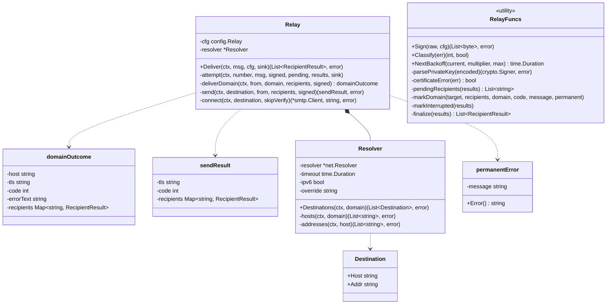

---

## 4. Package structure

```
internal/delivery/                                              3,900 LOC across 36 files
├── types.go                                          78   EmailMessage, TenantConfig, results; DomainOf, GroupByDomain
├── dispatcher.go                                    215   Processor/Sender seams; goroutine-per-message; terminal audit write
├── adapters.go                                       92   DomainLookup and ConfigurationStore over admin storage
├── utils/
│   ├── constants.go                                 103   Every enum and tuning constant in the module
│   └── errors.go                                     71   Sentinel errors and wrapping constructors
├── receiver/
│   ├── server.go                                     51   go-smtp server setup, connection cap, shutdown
│   ├── receiver.go                                  262   Backend + session: MAIL/RCPT/DATA, admission control, SMTP errors
│   └── authorizer.go                                 48   Sender-domain authorization, Redis then Postgres
├── relay/
│   ├── relay.go                                     453   Retry loop, per-domain send, STARTTLS, error classification
│   ├── mx.go                                        125   MX lookup with A/AAAA fallback and override hook
│   └── dkim.go                                       83   relaxed/relaxed SHA-256 signing; PKCS#8 then PKCS#1
└── engine/
    ├── engine.go                                     51   Processor implementation: resolve config, enforce, strip recipients
    ├── config_cache.go                              105   Redis-backed TenantConfig cache behind singleflight
    ├── dto/evaluation/evaluation_dto.go             251   All value types and all 16 interfaces
    ├── evaluation/evaluation_service.go             299   The Enforce orchestrator, report(), fail-open switch
    ├── parser/parser_service.go                     106   enmime parsing, HTML-to-text, attachment extraction
    ├── contentengine/content_engine.go               30   Fans parts out to each matcher for present rule types
    ├── incidentgenerator/
    │   ├── incident_generator.go                    122   EvaluationResult to email_incidents record
    │   └── dto/incident_dto.go                       18   GenerationInput, AuditWriter port
    ├── restrictionevalutor/
    │   ├── domain_evaluator.go                       66   Recipient-domain blocklist/allowlist checks
    │   └── attachment_evaluator.go                   48   File-extension blocklist/allowlist checks
    ├── rulematcher/
    │   ├── compiler.go                               90   PolicySet to CompiledSet; rule ceiling; bad regexes skipped
    │   ├── automaton.go                             122   Aho-Corasick build, failure links, scan
    │   ├── keyword_matcher.go                        77   Keyword RuleMatcher over the automaton
    │   ├── regex_matcher.go                          89   Regex RuleMatcher with per-rule match cap
    │   ├── matcher_factory.go                        27   Rule-type to matcher registry
    │   └── normalize.go                              11   NFKC + lowercase
    ├── policy/
    │   ├── dto/policyset/policyset_dto.go            14   PolicyRuleRow, the flat SQL projection
    │   ├── repositories/policyset/…_repository.go    52   One raw SQL join across six tables
    │   └── services/
    │       ├── aggregator/aggregator_service.go      77   Merge per-policy restrictions: BLOCK union, ALLOW intersect
    │       └── cache/policy_cache_service.go        254   Two-tier cache, singleflight, row assembly
    └── actiontrigger/
        ├── action_resolver.go                        24   Highest-priority action across matches
        ├── action_factory.go                         39   Action name to executor registry
        ├── executors.go                             101   Block executor; quarantine/redact/audit stubs
        ├── repositories/emailtemplate/…_repository.go 51  Template lookup, tenant override preferred
        └── services/blocknotice/…_service.go        195   Renders and relays the policy block notice
```

The directory `restrictionevalutor/` is spelled that way on disk. It is not a typo in this document.

---

## 5. Component reference

### `receiver.Backend` and `session`
[`receiver/receiver.go`](receiver/receiver.go)

Implements `smtp.Backend` and `smtp.Session` from `emersion/go-smtp`. `Mail` authorizes the sender domain and stashes the resulting `Authorization`; `Rcpt` validates the address, enforces `maxRcpt`, and on the **first** recipient takes a delivery slot; `Data` reads the body under a size limit, builds the `EmailMessage` with a fresh UUID correlation ID, writes the PROCESSING audit record, and hands off to the dispatcher.

The slot is taken at first RCPT rather than at connect so that a connection which never sends anything costs nothing, while a message that is about to consume a delivery goroutine reserves its capacity before the body is read. See [6.15](#615-admission-control).

Eight package-level `*smtp.SMTPError` values map each failure onto its SMTP code — `550` unauthorized sender, `501` malformed address, `452` too many recipients, `451` capacity exhausted / lookup down / audit down, `552` message too big.

### `receiver.Authorizer`
[`receiver/authorizer.go`](receiver/authorizer.go)

Redis first (`DomainCache.Domain`), Postgres on miss (`DomainStore.FindByDomain`), then a best-effort cache refill via `Remember`. A refill failure is logged and ignored — authorization still succeeds. `ErrDomainUnknown` from the store is the only error that becomes a `550`; anything else becomes a `451`, so a Postgres outage produces retryable rejections rather than permanent ones.

### `delivery.Dispatcher`
[`dispatcher.go`](dispatcher.go)

Owns the asynchronous half of the pipeline. `Dispatch` adds to a `sync.WaitGroup`, starts a goroutine, and defers both the `done` callback (which releases the receiver's slot) and a panic recovery that writes a terminal `UNKNOWN` failure audit. `run` calls `Process`, then `Deliver`, then `complete`. `Wait` blocks until every in-flight delivery has finished, which is what makes graceful shutdown possible.

Three terminal outcomes each write their own audit result: a processing error (`RULE` if all recipients were restricted, otherwise `PROCESSING`), a signing error (`DKIM`), or the relay's per-recipient results rolled up into `SUCCESS`/`FAILED`. See [6.17](#617-terminal-status-roll-up) for the roll-up rule.

### `engine.Engine`
[`engine/engine.go`](engine/engine.go)

Thin. Resolves the tenant's signing config, delegates to the `Enforcer`, replaces `msg.Recipients` with `outcome.Delivered`, and converts withheld recipients into `RecipientResult`s via `evaluation.Withhold`. A nil enforcer is legal and means "no policy evaluation" — the message passes straight through.

On an enforcer error it returns `ProcessResult{Withheld: …}` with no `Message` or `Config`, because the only field the dispatcher reads on that path is `Withheld`.

### `evaluation.EvaluationService`
[`engine/evaluation/evaluation_service.go`](engine/evaluation/evaluation_service.go)

The orchestrator. Its eight collaborators arrive in one `Components` struct, all as interfaces — alongside the `FailsClosed` flag — which is what makes the whole engine testable without infrastructure. `Enforce` is the decision flow in [1.4](#14-enforcement-decision-flow); `report` writes the incident and then runs the action executor, updating the incident with the outcome; `failure` is the fail-open switch.

One ordering detail worth internalising: `report` records the incident **before** invoking the action, and if the incident write fails under fail-open, the action is not invoked at all. The incident is the system of record; the action is a consequence of it.

### `cache.PolicyCacheService`
[`engine/policy/services/cache/policy_cache_service.go`](engine/policy/services/cache/policy_cache_service.go)

Two-tier, described fully in [6.7](#67-two-tier-policy-cache). L1 holds compiled sets in-process; L2 holds raw rows in Redis under `policy:set:<customerID>:<sender>`. `assemble` deduplicates the flat SQL rows into a `PolicySet`, decoding the two jsonb restriction columns as it goes.

### `engine.ConfigCache`
[`engine/config_cache.go`](engine/config_cache.go)

Redis-only cache of `TenantConfig` under `delivery:config:<configID>`, 10-minute TTL, `singleflight` on the key. The hit path re-checks `cached.CustomerID == customerID` before returning. Detail in [6.8](#68-signing-config-cache).

### `aggregator.Aggregator`
[`engine/policy/services/aggregator/aggregator_service.go`](engine/policy/services/aggregator/aggregator_service.go)

Merges per-policy restrictions into one `EffectiveRestrictions`. **BLOCK lists union, ALLOW lists intersect.** The consequences are not obvious and are spelled out in [6.4](#64-restriction-aggregation).

### `rulematcher.Compiler` and `BuildAutomaton`
[`engine/rulematcher/compiler.go`](engine/rulematcher/compiler.go), [`engine/rulematcher/automaton.go`](engine/rulematcher/automaton.go)

`Build` turns a `PolicySet` into a `CompiledSet`: it rejects sets over `MaxRules`, normalizes keyword values and feeds them to `BuildAutomaton`, compiles regexes (skipping and logging any that do not compile), and records which rule types are actually present so `ContentEngine` only invokes the matchers it needs.

### `relay.Relay`
[`relay/relay.go`](relay/relay.go)

Signs once, then runs up to `MaxAttempts` rounds over the still-pending recipients, grouping them by domain and walking each domain's MX destinations. `connect` does opportunistic STARTTLS with a single insecure retry on certificate errors, reporting `verified`, `unverified` or `none` — exactly the three values that land in `Attempt.TLS`. Full mechanics in [6.10](#610-relay-retry-state-machine) through [6.12](#612-opportunistic-starttls).

### `blocknotice.BlockNoticeService`
[`engine/actiontrigger/services/blocknotice/block_notice_service.go`](engine/actiontrigger/services/blocknotice/block_notice_service.go)

Renders the `policy_block_notice` template and relays it back to the original sender. Depends on three locally-declared interfaces (`TemplateStore`, `ConfigLoader`, `Sender`) rather than on the concrete relay, which is what keeps the package graph acyclic. Composition detail in [6.16](#616-block-notice-composition).

---

## 6. Low-level implementation notes

### 6.1 Aho-Corasick construction and scan

[`engine/rulematcher/automaton.go`](engine/rulematcher/automaton.go)

A byte-level trie: each node holds `next map[byte]int`, a `fail` link, and parallel `outputs`/`lengths` slices. `BuildAutomaton` inserts every normalized keyword, then `link()` computes failure links breadth-first.

The important part is in `link()`:

```go
			suffix := a.nodes[following].fail
			a.nodes[following].outputs = append(a.nodes[following].outputs, a.nodes[suffix].outputs...)
			a.nodes[following].lengths = append(a.nodes[following].lengths, a.nodes[suffix].lengths...)
```

Output sets are **merged from the failure target at link time**. That means `Find` never has to walk the suffix chain at scan time — at each position it emits every pattern ending there in one pass:

```go
		for index, pattern := range a.nodes[current].outputs {
			length := a.nodes[current].lengths[index]

			hits = append(hits, dto.AutomatonHit{
				Index: pattern,
				Start: position - length + 1,
				End:   position + 1,
			})
		}
```

Build is O(total pattern bytes); scan is O(len(text) + number of hits). `Start` and `End` are byte offsets into the **normalized** text, so they do not index back into the original message.

### 6.2 Normalization asymmetry

[`engine/rulematcher/normalize.go`](engine/rulematcher/normalize.go)

```go
func Normalize(value string) string {
	return strings.ToLower(norm.NFKC.String(value))
}
```

Applied to the rule value at **compile** time (`compiler.go`) and to each content part at **match** time (`keyword_matcher.go`). So keyword rules are case-insensitive and Unicode-compatibility-insensitive — full-width characters, ligatures and the like fold together.

Regex rules get none of this. `RegexMatcher.count` runs the pattern against `part.Text` directly. A regex rule is matched exactly as written, against the raw text. Author regex rules with that in mind: `(?i)` is yours to add.

### 6.3 Match counting and caps

Keyword matching accumulates a count per keyword index across all parts, and collects locations in a set which `ordered()` then emits in a fixed SUBJECT-before-BODY order — so `Locations` is deterministic regardless of part order.

Regex matching is capped per rule:

```go
	spans := expression.Pattern.FindAllStringIndex(text, m.maxMatches)

	count := 0

	for _, span := range spans {
		if span[1] > span[0] {
			count++
		}
	}
```

`maxMatches` defaults to `MaxMatchesPerRule = 1000`. Zero-width matches are discarded by the `span[1] > span[0]` guard, so a pattern like `a*` does not report one match per character.

### 6.4 Restriction aggregation

[`engine/policy/services/aggregator/aggregator_service.go`](engine/policy/services/aggregator/aggregator_service.go)

`combine` runs two passes over the policies. BLOCK values **union**, and the first policy to contribute a value owns the attribution:

```go
		for _, value := range restriction.Values {
			if _, seen := set.Blocked[value]; !seen {
				set.Blocked[value] = refs[index]
			}
		}
```

ALLOW values **intersect**, across only those policies that declare `Mode == ALLOW` with a non-empty `Values`. The first such policy seeds `set.Allowed`; every subsequent one intersects into it.

`RestrictionSet.Allowed` therefore has three meaningful states:

| State | Meaning |
|---|---|
| `nil` | No policy declares an allowlist. No allowlist is in force. |
| non-nil, non-empty | Only these values pass. |
| non-nil, empty | Nothing passes — the result of intersecting two disjoint allowlists. |

The third row is the one that surprises people. Two policies with allowlists `{a.com}` and `{b.com}` do not permit both domains; they permit neither.

### 6.5 Restriction evaluation order

[`engine/restrictionevalutor/domain_evaluator.go`](engine/restrictionevalutor/domain_evaluator.go), [`attachment_evaluator.go`](engine/restrictionevalutor/attachment_evaluator.go)

Blocklist first, and it `continue`s — a value on both lists is blocked. The allowlist is only consulted when `set.Allowed != nil`. Attribution for an allowlist violation comes from `anyRef`, which picks the **lowest PolicyID** so the attributed policy is stable across map-iteration order.

The attachment evaluator has an edge worth knowing:

```go
		if _, allowed := set.Allowed[attachment.Extension]; allowed && attachment.Extension != "" {
			continue
		}
```

An attachment with no recognisable extension (`Extension == ""`) can never match the blocklist, but it also cannot satisfy this guard — so under any allowlist, extensionless attachments violate.

### 6.6 The policy-set query

[`engine/policy/repositories/policyset/policy_set_repository.go`](engine/policy/repositories/policyset/policy_set_repository.go)

One raw query, run once per cache miss:

```sql
SELECT DISTINCT
    p.id,
    p.policy_name,
    p.action,
    p.domain_restriction,
    p.attachment_restriction,
    eu.id   AS email_user_id,
    r.id    AS rule_id,
    r.rule_name,
    r.type  AS rule_type,
    r.value AS rule_value
FROM email_users AS eu
JOIN      email_user_group_mapping AS m  ON m.email_user_id = eu.id        AND m.customer_id  = eu.customer_id
JOIN      policy_group_mapping     AS pg ON pg.group_id     = m.group_id   AND pg.customer_id = m.customer_id
JOIN      policies                 AS p  ON p.id            = pg.policy_id AND p.customer_id  = pg.customer_id
LEFT JOIN policy_rule_mapping      AS pr ON pr.policy_id    = p.id         AND pr.customer_id = p.customer_id
LEFT JOIN rules                    AS r  ON r.id            = pr.rule_id   AND r.customer_id  = pr.customer_id
WHERE eu.customer_id = ?
  AND eu.email = ?
  AND p.active = true
  AND p.type = ?
ORDER BY p.id ASC, r.id ASC NULLS FIRST
```

Two things to notice. **Every join predicate carries `customer_id`**, so tenant isolation is enforced at each hop and not only by the `WHERE` clause. And the rule joins are `LEFT JOIN`, so a policy with restrictions but no content rules still comes back — as a row with NULL rule columns. That is why `PolicyRuleRow` declares `RuleID *int`, `RuleName *string`, `RuleType *string`, `RuleValue *string`, and why `assemble` skips on `row.RuleID == nil` after having already registered the policy.

### 6.7 Two-tier policy cache

[`engine/policy/services/cache/policy_cache_service.go`](engine/policy/services/cache/policy_cache_service.go)

L1 is an in-process `map[string]entry` guarded by an `RWMutex`, each entry carrying its own `expiresAt`. L2 is Redis.

L2 caches the **raw rows, not the compiled set**. It has to: `CompiledSet` holds `*regexp.Regexp` values and the automaton, neither of which survives JSON. So Redis saves the database round-trip, and each process pays the compile cost itself.

The miss path is wrapped in `singleflight`, with a second L1 lookup *inside* the flight:

```go
	value, err, _ := c.group.Do(key, func() (any, error) {
		if cached, ok := c.lookup(key); ok {
			return cached, nil
		}
```

so the goroutines that queued behind a flight do not each recompile.

Key: `policy:set:<customerID>:<lowercased sender>`. TTL: `CacheTTL = 1m`. **There is no invalidation hook** — an admin editing a policy does not purge this cache. The change becomes visible within one TTL.

### 6.8 Signing-config cache

[`engine/config_cache.go`](engine/config_cache.go)

Redis-only, no L1, key `delivery:config:<configID>`, TTL 10 minutes, `singleflight` on the same key. The hit path carries a tenant check:

```go
	if cached, ok := c.read(ctx, configID); ok && cached.CustomerID == customerID {
		return cached, nil
	}
```

so a config ID belonging to another customer cannot be served. Note that the cached JSON contains `DKIMPrivateKey` — the signing key sits in Redis for the TTL, and a key rotation takes up to ten minutes to take effect.

### 6.9 MIME parsing and degradation

[`engine/parser/parser_service.go`](engine/parser/parser_service.go)

`enmime.ReadEnvelope` does the work. `envelope.Text` is preferred; when it is empty the HTML part is run through `VisibleText`, which applies three package-level regexes in order: strip `<script>`/`<style>` blocks with their contents, strip all remaining tags, collapse whitespace runs.

Only `envelope.Attachments` become `Attachment` records — inline parts are not evaluated for attachment restrictions. `ExtensionOf` lowercases, drops the leading dot, and returns empty for anything containing a space or slash.

The degraded path is the interesting one:

```go
	envelope, err := enmime.ReadEnvelope(bytes.NewReader(raw))
	if err != nil {
		return p.degraded(raw), utils.ErrMessageUnreadable
	}
```

`Parse` returns **both** a usable header-only `ParsedMessage` and an error. Under fail-open the caller logs the error and keeps the partial result, so an unparseable body is still evaluated against its Subject.

### 6.10 Relay retry state machine

[`relay/relay.go`](relay/relay.go)

`results map[string]RecipientResult` is the single source of truth across all rounds, seeded with every recipient at `PROCESSING`. Each round:

1. `pendingRecipients` — drops anything `SUCCESS` or `Permanent`.
2. `GroupByDomain` — buckets the remainder by recipient domain.
3. One `deliverDomain` per domain, sequentially, each emitting one `Attempt` to the sink.
4. If nothing is pending or `attempt == MaxAttempts`, stop.
5. `sleep(ctx, backoff)`; a cancelled sleep triggers `markInterrupted` and breaks.
6. `backoff = NextBackoff(backoff, multiplier, max)` — multiply and clamp.

`finalize` then rewrites any recipient still sitting at `PROCESSING` to `FAILED` with `"delivery did not complete"`.

The message is signed **once, before the loop**, so every attempt transmits byte-identical content and the DKIM signature stays valid across retries.

### 6.11 Per-destination send and error classification

`deliverDomain` walks MX destinations in preference order. A permanent error aborts the walk immediately; a temporary one falls through to the next destination. If the walk exhausts without success, the last error is classified and applied to every recipient of that domain.

Inside `send`, each recipient's RCPT is issued separately, so one rejected recipient does not take down the rest:

```go
		if err := client.Rcpt(recipient); err != nil {
			code, permanent := Classify(err)
			result.recipients[recipient] = delivery.RecipientResult{
				Email:     recipient,
				Domain:    delivery.DomainOf(recipient),
				Status:    deliveryutils.StatusFailed,
				SMTPCode:  code,
				Error:     err.Error(),
				Permanent: permanent,
			}

			continue
		}
```

If no recipient survives RCPT, the client quits without sending DATA. If DATA succeeds, every accepted recipient is marked `SUCCESS` with code 250 — correct, since SMTP returns one status for the whole DATA phase.

`Classify` resolves in three steps: `*permanentError` gives `(0, true)`; a `*textproto.Error` gives `(code, code >= 500)`; otherwise a leading three-digit code is parsed out of the error string, and only a valid 200–599 value is kept.

### 6.12 Opportunistic STARTTLS

[`relay/relay.go:249-298`](relay/relay.go#L249-L298)

STARTTLS is attempted whenever the peer advertises it. If it is not advertised, the connection continues in the clear as `TLSNone` — unless `RELAY_TLS_REQUIRED` is set, in which case a `permanentError` ends the attempt.

When the handshake fails on a certificate problem, there is exactly one retry:

```go
	if err := client.StartTLS(tlsConfig); err != nil {
		client.Close()

		if !skipVerify && certificateError(err) {
			return r.connect(ctx, destination, true)
		}

		return nil, deliveryutils.TLSNone, err
	}
```

`certificateError` recognises four types: `*tls.CertificateVerificationError`, `x509.HostnameError`, `x509.UnknownAuthorityError`, `x509.CertificateInvalidError`. The retry re-dials with `InsecureSkipVerify` and reports `TLSUnverified`. This is standard opportunistic-TLS behaviour for MTA-to-MTA delivery — encryption preferred, delivery not sacrificed to a bad certificate — and the audit trail records which of the three states applied.

### 6.13 DKIM signing

[`relay/dkim.go`](relay/dkim.go)

relaxed/relaxed canonicalisation, SHA-256, over a fixed header list:

```go
var signedHeaders = []string{
	"From",
	"To",
	"Cc",
	"Subject",
	"Date",
	"Message-ID",
	"MIME-Version",
	"Content-Type",
	"Content-Transfer-Encoding",
}
```

Headers absent from the message are simply not signed. `parsePrivateKey` decodes the PEM block, tries PKCS#8 first and falls back to PKCS#1, and in the PKCS#8 case requires the result to satisfy `crypto.Signer` — so an EC or Ed25519 key would be accepted structurally, though the DKIM record would need to match.

### 6.14 MX resolution

[`relay/mx.go`](relay/mx.go)

`RELAY_MX_OVERRIDE` short-circuits all DNS and returns a single destination — this is the local-development hook that points delivery at Mailpit.

Otherwise: `LookupMX`, sorted stable by preference. On a lookup failure that is not temporary, the resolver first confirms the domain resolves at all; if it does, the domain itself is used as its own MX (implicit MX, per RFC 5321); if it does not, `ErrNoDestination`. Each host is then expanded to every A/AAAA address, with AAAA filtered out unless `RELAY_IPV6` is set. Port 25 is hardcoded:

```go
			destinations = append(destinations, Destination{Host: host, Addr: net.JoinHostPort(address, "25")})
```

### 6.15 The SMTP → Redis handoff

[`queue.go`](queue.go), [`handler/smtp/receiver.go`](handler/smtp/receiver.go)

The receiver does SMTP work only: authorize the sender, validate recipients, enforce
`SMTP_MAX_RECIPIENTS` and `SMTP_MAX_SIZE`, read DATA, mint the correlation and message
ids, write the `PROCESSING` audit record, then `XADD` to `delivery:messages`.

There is no delivery-slot channel any more. SMTP connection capacity
(`SMTP_MAX_CONNECTIONS`, enforced by `netutil.LimitListener`) and delivery-processing
capacity (`DELIVERY_WORKERS`) are now independent, with the stream as the buffer between
them.

The publish is the acceptance boundary. On failure the receiver completes the audit
record as `FAILED` and returns `451`, so no message is ever acknowledged that did not
reach Redis, and no orphan `PROCESSING` record is left behind.

Entries carry `id`, `correlation_id`, `customer_id`, `config_id`, `envelope_from`,
`sender_domain`, `recipients` (JSON) and `raw` as native stream fields — no envelope
JSON wrapper, so the body is not base64'd. `customer_id` and `config_id` are on the
entry because the worker needs both for policy resolution and DKIM signing.

### 6.16 Block-notice composition

[`engine/actiontrigger/services/blocknotice/block_notice_service.go`](engine/actiontrigger/services/blocknotice/block_notice_service.go)

Loop guard first — if the original sender is already `no-reply@<senderDomain>`, the notice is skipped and `nil` returned, so a notice can never trigger a notice.

Template lookup prefers the tenant's own row over the system row, by ordering on a boolean expression:

```go
		Where("name = ? AND customer_id IN ?", name, []int{db.SystemCustomerID, customerID}).
		Clauses(clause.OrderBy{
			Expression: clause.Expr{SQL: "(customer_id = ?) DESC", Vars: []any{customerID}},
		}).
```

`variables()` builds the substitution map — org name, joined policy names, policy count, reason (`NoticeReasonRestriction` or `NoticeReasonContent` depending on the trigger), subject (falling back to `(no subject)`), the blocked recipients (falling back to all recipients when none were withheld), message ID, correlation ID, and an RFC1123Z timestamp.

`render()` treats subject and body differently: the body is HTML-escaped, the subject instead has CR and LF stripped — header-injection protection rather than escaping.

`compose()` writes the headers by hand and base64-encodes the body, wrapped at `NoticeLineLength = 76`. Two headers exist specifically to stop mail loops and out-of-office storms:

```go
	message.WriteString("Auto-Submitted: auto-replied\r\n")
	message.WriteString("X-Auto-Response-Suppress: All\r\n")
```

The notice **reuses the original message's `CorrelationID`**, which is what lets an operator tie the notice back to the incident that caused it. Only the `Message-ID` is fresh (`<uuid@senderDomain>`).

Delivery goes through the same relay, and any recipient that does not come back `SUCCESS` turns into `NoticeNotDelivered`, which `BlockExecutor` downgrades to `ActionResult{Status: FAILED}` rather than propagating — a failed notice does not fail the block.

### 6.17 Terminal status roll-up

[`dispatcher.go:130-148`](dispatcher.go#L130-L148)

Withheld recipients are appended to the relay's results before the roll-up, and the roll-up skips them:

```go
	for _, result := range results {
		if result.Status == deliveryutils.StatusBlocked {
			continue
		}

		if result.Status != deliveryutils.StatusSuccess {
			status = auditutils.StatusFailed
			failure = &auditdto.Failure{
				Type:     auditutils.FailureRelay,
				Reason:   result.Error,
				SMTPCode: result.SMTPCode,
			}

			break
		}
	}
```

So a message whose restricted recipients were withheld, and whose remaining recipients all delivered, is recorded `SUCCESS`. A policy block is not a delivery failure. The first non-SUCCESS, non-BLOCKED recipient becomes the audit `Failure` and ends the loop — the record names one cause, not all of them.

---

## 7. Data and configuration reference

### 7.1 Enumerations

All from [`utils/constants.go`](utils/constants.go).

| Group | Values |
|---|---|
| Recipient / audit status | `PROCESSING` · `SUCCESS` · `FAILED` · `BLOCKED` |
| Failure type | `RULE` · `PROCESSING` · `DKIM` · `RELAY` · `UNKNOWN` |
| TLS state | `none` · `verified` · `unverified` |
| Decision | `PASS` · `FLAGGED` |
| Trigger | `RESTRICTION` · `CONTENT` |
| Restriction mode | `NONE` · `BLOCK` · `ALLOW` |
| Restriction kind | `DOMAIN` · `ATTACHMENT` |
| Matcher type | `KEYWORD` · `REGEX` |
| Match location | `SUBJECT` · `BODY` |
| Action | `NONE` · `AUDIT` · `REDACT` · `QUARANTINE` · `BLOCK` |
| Action status | `PENDING` · `INVOKED` · `FAILED` |

Action priority, used by `ActionResolver` to pick one effective action across many matches:

| Action | Priority |
|---|---:|
| `NONE` | 0 |
| `AUDIT` | 1 |
| `REDACT` | 2 |
| `QUARANTINE` | 3 |
| `BLOCK` | 4 |

### 7.2 Compile-time constants

| Constant | Value | Effect |
|---|---|---|
| `MaxRules` | 2000 | A policy set above this is rejected with `ErrTooManyRules` rather than compiled |
| `MaxMatchesPerRule` | 1000 | Ceiling on regex matches counted per rule |
| `CacheTTL` | 1m | Policy-set cache lifetime, both tiers |
| `configCacheTTL` | 10m | Signing-config cache lifetime |
| `FailClosed` | false | Fail-open: evaluation failures deliver rather than block |
| `EvaluationEnabled` | true | Declared in constants; not currently read |
| `DefaultDKIMSelector` | `dpdp` | Used when the stored config has no selector |
| `NoticeMailbox` | `no-reply` | Local part the block notice is sent from |
| `NoticeLineLength` | 76 | Base64 wrap width in the notice body |

### 7.3 Environment variables

SMTP receiver — [`config/smtpserver.go`](../config/smtpserver.go):

| Variable | Default | Effect |
|---|---|---|
| `SMTP_SERVER_ADDR` | `:2525` | Listen address |
| `SMTP_MAX_SIZE` | 10485760 | Max message bytes; over it, `552` |
| `SMTP_MAX_RECIPIENTS` | 100 | Max RCPT per message; over it, `452` |
| `SMTP_MAX_CONNECTIONS` | 100 | Socket-level cap via `netutil.LimitListener` |
| `SMTP_READ_TIMEOUT` | 1m | Per-connection read timeout |
| `SMTP_WRITE_TIMEOUT` | 1m | Per-connection write timeout |
| `SHUTDOWN_TIMEOUT` | 30s | Bounds the worker drain on shutdown |

Delivery handoff — [`config/delivery.go`](../config/delivery.go):

| Variable | Default | Effect |
|---|---|---|
| `DELIVERY_STREAM` | `delivery:messages` | Redis stream the receiver publishes to |
| `DELIVERY_CONSUMER_GROUP` | `delivery-workers` | Consumer group; one entry goes to one worker |
| `DELIVERY_WORKERS` | 4 | Delivery-processing concurrency |
| `DELIVERY_CLAIM_IDLE` | 5m | Pending time after which another worker reclaims an entry |
| `DELIVERY_BATCH_SIZE` | 10 | `XREADGROUP`/`XAUTOCLAIM` count |
| `DELIVERY_BLOCK_TIME` | 1s | `XREADGROUP` block duration |

Relay — [`config/relay.go`](../config/relay.go):

| Variable | Default | Effect |
|---|---|---|
| `RELAY_HELO_HOST` | `dpdp.local` | HELO/EHLO name, also the receiver's advertised domain |
| `RELAY_DIAL_TIMEOUT` | 30s | TCP dial timeout per destination |
| `RELAY_DNS_TIMEOUT` | 10s | Bounds the whole MX + address lookup |
| `RELAY_MAX_ATTEMPTS` | 3 | Delivery rounds before giving up |
| `RELAY_BACKOFF_INITIAL` | 1m | First inter-round delay |
| `RELAY_BACKOFF_MULTIPLIER` | 5 | Multiplier per round |
| `RELAY_BACKOFF_MAX` | 15m | Backoff ceiling |
| `RELAY_TLS_REQUIRED` | false | When true, no STARTTLS means permanent failure |
| `RELAY_IPV6` | false | When false, AAAA addresses are skipped |
| `RELAY_MX_OVERRIDE` | *(empty)* | Bypasses DNS entirely; `host` or `host:port` |

`envInt` and `envDuration` fall back to the default on any parse error **and** on any value ≤ 0, so `DELIVERY_WORKERS=0` does not disable the pool — it yields 4.

`SMTP_MAX_SIZE` is the only message-size limit: the receiver rejects an oversized message with `552` before publishing, so no stream entry can exceed it.

### 7.4 Errors and how they surface

From [`utils/errors.go`](utils/errors.go).

| Error | Raised by | Surfaces as |
|---|---|---|
| `ErrDomainUnknown` | `ConfigurationStore`, `Authorizer` | SMTP `550 5.7.1` at MAIL FROM |
| `ErrAllRecipientsRestricted` | `EvaluationService.Enforce` | Audit `FAILED` / `RULE` |
| `ErrPrivateKeyMissing` | `ConfigurationStore.SigningConfig` | Audit `FAILED` / `PROCESSING` |
| `ErrPrivateKeyInvalid` | `relay.parsePrivateKey` | Audit `FAILED` / `DKIM` |
| `ErrNoDestination` | `Resolver.Destinations` | Recipient `FAILED`, permanent |
| `ErrSigningConfigMissing` | `ConfigCache`, `PolicyCacheService` | Audit `FAILED` / `PROCESSING` |
| `ErrTooManyRules` | `Compiler.Build` | Audit `FAILED` / `PROCESSING` (fail-open: delivered) |
| `ErrMessageUnreadable` | `MessageParser.Parse` | Logged; headers-only evaluation under fail-open |
| `ErrNoticeTemplateMissing` | `EmailTemplateRepository.Find` | Incident `ActionStatus = FAILED` |
| `ErrNoticeSenderMissing` | `BlockNoticeService.Notify` | Incident `ActionStatus = FAILED` |
| `ErrNoticeNotDelivered` | `BlockNoticeService.Notify` | Incident `ActionStatus = FAILED` |
| `ErrUnknownMatcher` / `ErrUnknownAction` | Declared; registries return `ok=false` instead | Logged, evaluation continues |

Receiver-side SMTP codes not backed by a sentinel: `501 5.1.3` malformed address, `452 4.5.3` too many recipients, `451 4.3.2` capacity exhausted, `451 4.3.0` lookup or audit unavailable, `552 5.3.4` message too big.

---

## 8. Concurrency, failure and lifecycle

**A fixed worker pool, not a goroutine per message.** `DELIVERY_WORKERS` consumers each run `XREADGROUP` in a loop, plus one reclaimer and one stats reporter, all tracked by a single `sync.WaitGroup`. Concurrency is bounded on the way *out*, by the pool; the stream absorbs bursts that arrive faster than the pool drains them.

**Panic containment.** Every delivery goroutine defers a recovery that logs and writes a terminal audit record with failure type `UNKNOWN`. A panic in evaluation or relay kills that message, not the process.

**Writes that must survive cancellation.** `Dispatcher.complete` uses `context.WithoutCancel(d.ctx)` so the terminal audit write lands even when the application context has already been cancelled. `BlockExecutor` does the same for the notice. The `sink` that writes attempts does not — intermediate attempt records are best-effort.

**Shutdown ordering**, [`cmd/api/main.go:286-312`](../../cmd/api/main.go#L286-L312):

1. A `shutdownCtx` is created with `SHUTDOWN_TIMEOUT` as its deadline.
2. `smtpServer.Shutdown(shutdownCtx)` — stop accepting new SMTP connections.
3. `server.Shutdown(shutdownCtx)` — stop the HTTP API.
4. `servers.Wait()` — both listeners have returned.
5. `stopWorkers()` cancels the worker context — the consumers stop asking Redis for new entries, but a worker already inside `Process` runs to completion.
6. `workers.Wait()` runs in its own goroutine, closing a `drained` channel when finished; a `select` races it against `shutdownCtx.Done()`.

An entry whose worker does not finish inside the budget is simply never acked, so it stays pending and the next process to start reclaims it. Nothing is acknowledged that did not complete.

Draining is bounded, not guaranteed — but unlike before, exceeding the deadline is now recoverable rather than lossy: the entry is still pending in Redis. The terminal audit write and the `XACK` both use `context.WithoutCancel`, so a delivery that does finish during shutdown records its outcome and acknowledges cleanly.

**Session context.** `session.ctx` is `context.Background()`, not derived from the connection, and the dispatcher uses the long-lived application context. There is no per-message deadline; the bounds that exist are the dial, DNS and read/write timeouts.

**The fail-open switch.** `FailsClosed = false` means a policy-resolution failure, an incident-write failure, or an unparseable body results in **delivery**, not blocking. `EvaluationService.failure` still propagates `context.Canceled` regardless of the flag, so a shutdown does not masquerade as a pass.

---

## 9. Design discussion

### 9.1 Accept then process

`session.Data` writes the audit record, calls `Dispatch`, and returns `nil` — SMTP `250` — before any policy has run. The sending MTA gets a fast, bounded response and is never held open for DNS, DKIM and relay latency.

The cost is structural: **a policy decision can never be surfaced as an SMTP rejection.** By the time the engine decides to block, the gateway has already accepted responsibility for the message. That is exactly why the block notice exists — it is the only remaining channel for telling a sender their mail was withheld, and it is why `BlockExecutor` treats a failed notice as a failed *action* rather than a failed delivery.

The alternative — evaluate inside `DATA` and reject with a 5xx — would give senders immediate, in-protocol feedback, at the price of holding the connection for the entire evaluation and making Redis/Postgres latency visible to every sending MTA.

### 9.2 Fail-open by default

`FailClosed = false`. A Redis outage, a Postgres timeout, a malformed MIME body — each results in the message being delivered unevaluated.

This is a security posture, not an implementation detail, and it is worth stating plainly: anyone who can degrade the policy store can degrade enforcement. The counter-argument is equally plain — a DLP gateway that blocks all mail when its cache is unavailable is an outage with a blast radius of the entire organisation. The project chose availability, and made the choice a single constant so it can be reversed.

### 9.3 Interface-per-consumer

The module declares its ports where they are **used**, not where they are implemented: `blocknotice.Sender`, `engine.SigningLoader`, `cache.Builder`, `cache.PolicySetStore`, `receiver.DomainCache`, `receiver.DomainStore`.

This is idiomatic Go, and here it earns its keep twice. It is what keeps the import graph acyclic despite a genuine runtime cycle (block notice → relay → MX → back). And it is why every collaborator in `backend/tests/delivery/` can be a hand-written fake — there is no mocking framework in the dependency tree.

The cost is duplication: `blocknotice.Sender` and `delivery.Sender` are structurally identical, declared twice. That is the trade the language asks for, and at this scale it is a reasonable one.

### 9.4 One DTO package as the stability anchor

All 16 engine contracts and every engine value type live in one leaf package with zero internal imports. Every other engine package depends inward on it.

The benefit: one file to read to understand the entire engine's surface, and a dependency graph that cannot tangle. The cost: [`evaluation_dto.go`](engine/dto/evaluation/evaluation_dto.go) is 251 lines that every engine change touches, and four unrelated concerns — parsing, matching, actions, incidents — share a namespace.

### 9.5 Caching without invalidation

Three caches, two invalidation strategies.

The authorized-domain cache **is** invalidated — the admin email-provider service calls `SyncDomain` when a configuration changes, so a newly added or removed sending domain takes effect immediately.

The policy-set cache and the signing-config cache are **not**. They are purely TTL-bounded: a policy edit takes up to 1 minute to apply, a DKIM key rotation up to 10 minutes. For policy edits that is usually acceptable. For key rotation it is worth knowing before you rotate.

The L1 tier makes staleness per-instance. With two backends running, the two can disagree about a policy for up to a TTL — and there is no way to tell from the outside which one evaluated a given message.

### 9.6 Compiled state is process-local

`CompiledSet` cannot cross a process boundary: it holds `*regexp.Regexp` and the automaton. That constraint is what forces the two-tier split — Redis caches the cheap, serialisable part (the rows) and each process pays the compile cost itself.

The same locality applies to `DELIVERY_WORKERS`: 4 means 4 per instance. The consumer group, however, *is* shared — Redis hands each entry to exactly one worker across every instance, so adding instances adds throughput without duplicating deliveries. Caches remain per-instance.

### 9.7 Matching semantics a policy author will notice

Three consequences that are correct in the code and surprising in practice:

- **No word boundaries.** The automaton matches substrings. A keyword rule for `cat` fires on `concatenate`. Rules for short tokens will produce false positives; use the regex type with `\b` when boundaries matter.
- **Keywords are normalized, regexes are not** ([6.2](#62-normalization-asymmetry)). A keyword rule is case- and width-insensitive for free; a regex rule needs `(?i)` written in.
- **Allowlists intersect** ([6.4](#64-restriction-aggregation)). Attaching a second policy with a different domain allowlist *narrows* delivery. Two policies allowing different domains allow nothing.

### 9.8 Blast-radius limits

The module fails small in several deliberate places. `MaxRules = 2000` rejects an oversized policy set outright rather than compiling it. `MaxMatchesPerRule = 1000` caps regex work per rule. A regex that does not compile is skipped and logged rather than failing the whole set — one bad rule does not disable a policy. The receiver caps size, recipients, connections and concurrent deliveries independently.

What is not capped: the number of attachments parsed per message, and the number of MX destinations walked per attempt. Both are bounded in practice by message size and DNS, not by the code.

### 9.9 Durability of the audit trail

The audit record is created **before** the `250` is returned, and `Data` returns `451` if that write fails — so no message is ever accepted without a record existing for it. The terminal write survives cancellation, and even a panic produces a terminal record. Both endpoints of the audit are guaranteed.

The middle is not. `RecordAttempt` failures are logged and swallowed, so the per-attempt trail is best-effort. If you are reconciling, trust `Create` and `Complete`; treat `attempts` as advisory.

### 9.10 What the module deliberately does not do

- **No queue, no persistence of the body.** An in-flight message exists only in memory. A hard process kill after the `250` loses it, bounded only by `dispatcher.Wait()` on graceful shutdown.
- **No bounce handling, no DSN generation.** A permanent failure is recorded in the audit and nothing is sent back to the sender. The block notice is for policy blocks, not for delivery failures.
- **Three of four actions are stubs.** `QUARANTINE`, `REDACT` and `AUDIT` are registered, resolved, executed and recorded as `INVOKED` — and do nothing but write a log line. A policy carrying one of them produces a complete-looking incident record and delivers the mail unchanged.
- **`BLOCK` does not always block.** Only a *restriction* violation removes recipients, and it does so before the action layer is reached ([1.4](#14-enforcement-decision-flow)). When `BLOCK` is the effective action of a *content* match, `Enforce` returns `Delivered: message.Recipients` — every recipient intact — and the relay delivers the message. `BlockExecutor` still fires, so the sender receives the seeded `policy_block_notice`, whose subject reads *"Your message was not delivered"*, about a message that was. Each component reports its own step accurately; it is the combination that misleads. Worth knowing before writing a content rule with a `BLOCK` action.

---

## 10. Extension points

Three registries cover most of what a new feature would need.

**Add a rule matcher.** Implement `dto.RuleMatcher` (`Type() string`, `Match(MatchInput, CompiledRules) []RuleMatch`), register it in `DefaultMatcherFactory` in [`engine/rulematcher/matcher_factory.go`](engine/rulematcher/matcher_factory.go), add the type constant to [`utils/constants.go`](utils/constants.go), and give `Compiler.Build` a case that compiles the rule value into `CompiledRules`. `ContentEngine` only invokes matchers for rule types actually present in the set, so nothing else needs to change. Tests: `backend/tests/delivery/engine/rulematcher/`.

**Add an action.** Implement `dto.ActionExecutor` (`Action() string`, `Execute(ctx, ActionRequest) (ActionResult, error)`), register it in `DefaultActionFactory` in [`engine/actiontrigger/action_factory.go`](engine/actiontrigger/action_factory.go), add the constant **and its entry in the `actionPriority` map** — an action missing from that map resolves to priority 0 and will lose to every other action. Tests: `backend/tests/delivery/engine/actiontrigger/`.

**Add a restriction evaluator.** Implement the evaluation interface, add a field to `evaluation.Components`, call it in `Enforce` alongside the domain and attachment checks, and wire it in [`cmd/api/main.go`](../../cmd/api/main.go). Note that restriction violations currently force `ActionBlock` unconditionally — a new evaluator inherits that.

The test tree at `backend/tests/delivery/` mirrors this package structure file for file, with `integration_test.go` behind a build tag covering the full receiver-to-relay path.
